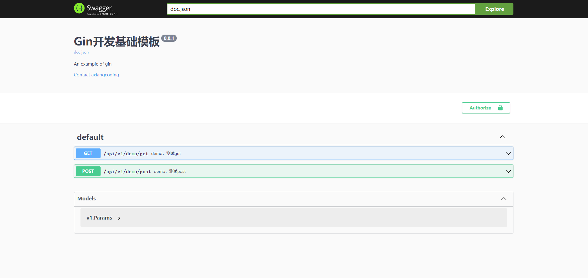

# Go Gin Template [](https://goreportcard.com/report/github.com/axiangcoding/go-gin-template)  [](./LICENSE)

Switch language: [中文](./README_ZH.md)|English

## Introduction

Use [Gin](https://github.com/gin-gonic/gin) to build an initial template for web applications, which basically involves the technologies and ideas involved in daily development, defines the structure of the project, and provides some simple examples are for use. Of course, we must realize that Go is a relatively open language, and Gin also provides a very concise API for use. Therefore, the structure of the project can also be adjusted according to the actual needs. The standardized structure is only for the team to be able to code in a unified style, to provide the best coding experience.


## How To Run

### Environment

1. First, please make sure that Go has been installed on your machine. For the installation method, please refer to the official website https://golang.org/dl/

2. [TODO] Second, because this project also uses Docker to establish a development environment, if you need to ensure that the Demo runs normally, please make sure that Docker is installed on your machine. For the installation method, please refer to the official website https://www.docker.com/get-started

3. Of course, if you know exactly what services you need, you can also use self-built services (such as Redis, Mysql, etc.) to replace the test environment provided by Docker

### Configuration
The reading of the configuration file in this project follows the following rules:
- If the `config/app.toml` configuration file exists, read `config/app.toml` as the configuration file
- If it does not exist, use the default configuration file `config/default/app.toml`

Therefore, it is recommended that you copy `config/default/app.toml` to `config/app.toml` and modify `config/default/app.toml`, so that you can quickly recover after you modify the configuration file by mistake. The content of the configuration file is roughly as follows:

```
[app]
version = "0.0.1"
name = "Gin Development Template"

[app.filelog]
enable = false
path = "./logs/"

[server]
run_mode = "debug"
port = 8080

···
```

### Running
```
$ git clone https://gitee.com/axiangcoding/go-gin-template.git
$ cd go-gin-template
$ # [TODO] automatic start docker-compose
$ go run main.go
```

The running information of the project will appear in your console:

```
[GIN-debug] [WARNING] Creating an Engine instance with the Logger and Recovery middleware already attached.

[GIN-debug] [WARNING] Running in "debug" mode. Switch to "release" mode in production.
 - using env:   export GIN_MODE=release
 - using code:  gin.SetMode(gin.ReleaseMode)

[GIN-debug] GET    /api/v1/demo/get          --> gin-template/api/v1.DemoGet (3 handlers)
[GIN-debug] POST   /api/v1/demo/post         --> gin-template/api/v1.DemoPost (3 handlers)
[GIN-debug] GET    /swagger/*any             --> github.com/swaggo/gin-swagger.CustomWrapHandler.func1 (3 handlers)
```
Next, visit the address: [http://localhost:8080/swagger/index.html](http://localhost:8080/swagger/index.html), you will see the following interface:


Finally, you are free to use!

## Feature

- Gin (Web framework)
- Swagger (Open Doc)
- Viper (Config)
- Zap (Log) 
- JWT (Verify)
- Graceful stop (Server)

## Reference

You can see farther by standing on the shoulders of giants

- https://github.com/eddycjy/go-gin-example/blob/master/README.md
- https://sodocumentation.net/go/topic/9463/best-practices-on-project-structure
- https://docs.docker.com/get-docker/
- https://gin-gonic.com/docs/
- https://github.com/swaggo/swag/blob/master/README.md
- https://github.com/spf13/viper/blob/master/README.md
- https://pkg.go.dev/github.com/golang-jwt/jwt#section-documentation
- https://github.com/uber-go/zap/blob/master/README.md
- https://github.com/natefinch/lumberjack/blob/v2.0/README.md

## Contact me

Email to <axiangcoding@gmail.com>
